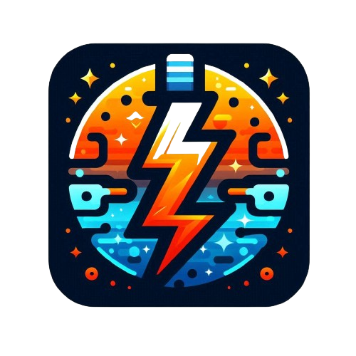

<a name="readme-top"></a>

<!-- PROJECT LOGO -->
<br />
<div align="center">
  <a href="https://github.com/lildibbb/SparkCharge">
    
  </a>
  <h3 align="center">Electricity Bills Calculator</h3>
  <p align="center">
    An app to calculate electricity charges based on units consumed and rebate percentage.
    <br />
  </p>
</div>

<!-- DEMO GIF -->
<div align="center">
  
</div>

<!-- ABOUT THE PROJECT -->
## About The Project

**SparkCharge** is an electricity bills calculator project that allows users to input the number of electricity units consumed and an optional rebate percentage. The app then calculates the total charges based on these inputs.

### Built With

[![Flutter][Flutter]][Flutter-url]

## Getting Started

To run this app on your local machine, follow these steps:

### Prerequisites

- **Flutter SDK:** Make sure you have the Flutter SDK installed. You can download it from the official Flutter website: [https://flutter.dev/](https://flutter.dev/)

### Installation

1. **Clone the repo:**

   ```sh
   git clone https://github.com/lildibbb/SparkCharge

   ```

2. **Install dependencies:**

   ```sh
   flutter pub get

   ```

3. **Run the code:**
   ```sh
   flutter run
   ```

<p align="right">(<a href="#readme-top">back to top</a>)</p>


<!-- CONTRIBUTING -->

## Contributing

Contributions are what make the open source community such an amazing place to learn, inspire, and create. Any contributions you make are **greatly appreciated**.

If you have a suggestion that would make this better, please fork the repo and create a pull request. You can also simply open an issue with the tag "enhancement".
Don't forget to give the project a star! Thanks again!

1. Fork the Project
2. Create your Feature Branch (`git checkout -b feature/AmazingFeature`)
3. Commit your Changes (`git commit -m 'Add some AmazingFeature'`)
4. Push to the Branch (`git push origin feature/AmazingFeature`)
5. Open a Pull Request

<p align="right">(<a href="#readme-top">back to top</a>)</p>

<!-- LICENSE -->

## License

Distributed under the MIT License. See `LICENSE` for more information.

<p align="right">(<a href="#readme-top">back to top</a>)</p>

<!-- MARKDOWN LINKS & IMAGES -->
<!-- https://www.markdownguide.org/basic-syntax/#reference-style-links -->

[Flutter]: https://img.shields.io/badge/Flutter-%2302569B.svg?style=for-the-badge&logo=Flutter&logoColor=white
[Flutter-url]: https://flutter.dev/
